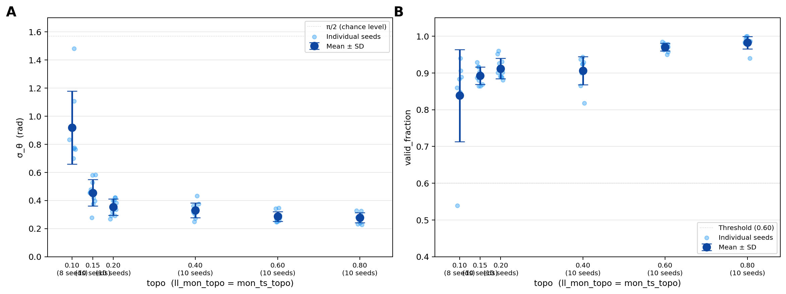

# LateralLine STDP — Results Summary (2026-05-13)

## The scientific question

> Can spike-timing-dependent plasticity (STDP) plus lateral inhibition self-organise a somatotopic map in the Torus semicircularis (TS) when the upstream MON layer has only **weak** anatomical somatotopy?

The trivial case — strong, hand-wired anatomical topography in MON — has always worked and is not interesting. The question is whether the network can *learn* the map when the anatomical scaffold is genuinely weak. This is the central hypothesis of the thesis.

## TL;DR

**Yes**, with one important qualification. The recipe documented in `BASELINE.md` produces a population-level somatotopic map in TS at MON anatomical somatotopy as low as **`ll_mon_topo = mon_ts_topo = 0.15`**, comfortably below the high-topo reference (0.80) used in earlier work. At the **best operating point (topo = 0.20)** the recipe is highly reliable: 10 / 10 seeds give σ_θ < 0.5 rad and valid_fraction > 0.86. At **topo = 0.15** it remains reliable but with broader maps. At the **floor (topo = 0.10)** it becomes unstable — most seeds still produce a map, but ~10 % fail outright.

The full topo gradient (0.10 → 0.80, 10 seeds each) is now complete. Map quality improves monotonically with anatomical topography, but the improvement flattens sharply above topo = 0.20: going from 0.20 to 0.80 reduces mean σ_θ by only ~0.07 rad (0.353 → 0.278), while going from 0.10 to 0.20 reduces it by 0.57 rad (0.919 → 0.353). **The recipe already captures the vast majority of achievable map quality at weak somatotopy.**

A persistent imperfection across all topo levels is **multimodal per-TS-cell tuning** (vertical bands in TS spike rasters) — see "Open questions" below.

---

## Methods

### Network architecture

Three-layer feed-forward network (defaults from `params.py`, mode `ll_thesis`):

| Layer | Size | Role |
|---|---|---|
| **LL** (lateral-line afferents) | 100 | Poisson input, one neuron per neuromast, x-positions equispaced on a 4 cm body |
| **MON** (intermediate) | 3200 | LIF spiking, plastic incoming synapses (LL → MON STDP) |
| **TS** (map output) | 300 | LIF spiking, plastic incoming synapses (MON → TS STDP), lateral inhibition |

LIF parameters (identical for MON and TS): `V_th = -54 mV`, `V_reset = -60 mV`, `E_L = -74 mV`, `τ_m = 10 ms`, `τ_s = 2 ms`, refractory 2 ms. Numerical integration: Brian2, `dt = 1 ms`.

### Connectivity — the topography knob

LL → MON and MON → TS connectivity each mix two components:
- a **random** part (uniform connection probability)
- a **topographic** part (Gaussian centred at the somatotopically matched position)

The fraction that follows topography is set by the parameters `ll_mon_topo` and `mon_ts_topo` (both denoted *topo* below). At `topo = 0.0` connections are fully random; at `topo = 1.0` they are fully Gaussian-topographic. **All experiments here use `ll_mon_topo = mon_ts_topo`** — the two are varied together. Each MON cell receives 10 inputs from LL (`--ll-mon-in-degree 10`); each MON cell projects to 16 TS cells (`out-degree 16`).

### Stimulus

A small sphere ("dipole") moves past the lateral line at fixed speed (5 cm/s) at lateral distance `d`. The hydrodynamic velocity field at each LL position is computed analytically (`stimulus.hydrodynamic_velocity_parallel`). Each LL neuromast fires an inhomogeneous Poisson spike train with rate `r_0 + A · v(x_i, x_source, d) + spatial-correlated noise`, clipped to `[0, r_max]`.

For all experiments in the topo gradient below, the training distance is **fixed at `d = 0.8 cm`** (`--training-distance-min-cm 0.8 --training-distance-max-cm 0.8`). A multi-distance pilot (d ∈ [0.6, 1.2] cm) was completed on 2026-05-09 — see "Multi-distance pilot" section below.

### Training protocol

- **10 000 trials**, each 1.2 s long.
- Each trial holds the source position fixed for 50 ms windows (`training_position_hold_s = 0.05`) and sweeps positions across the body in **balanced ordered forward/backward sweeps** (`training_ordered_sweeps = True`) so every x-position receives equal training time.
- Source distance fixed at 0.8 cm (see above).
- Source direction fixed (no bidirectional flipping).
- **No additive LL noise** during training (`training_noise_scale_early/late = 0.0`) — only the spatially-correlated background of the stimulus model is present.
- Background drive in MON: Poisson at 18 Hz, EPSP weight 1.5 mV.

### Plasticity

Both LL → MON and MON → TS use **multiplicative STDP** (Brian2 implementation in `ll_stdp_brian2.py`). The current BASELINE values:

| Synapse | apre (LTP) | apost (LTD) | wmax | w_init | w_jitter | homeo η |
|---|---|---|---|---|---|---|
| LL → MON | 0.010 | -0.0105 | 20 mV | 10 mV | **8 mV** | **0.005** |
| MON → TS | 0.010 | -0.006 | 0.028 | 0.020 | 0.005 | **0.001** |

The **wide LL → MON initial jitter (8 mV, range 2–18 mV)** is essential — it breaks initial symmetry between MON cells so that STDP has a non-trivial bias to amplify.

### Homeostasis

Both synapses also carry a slow **multiplicative homeostatic rescaling** of incoming weights, applied every 10 trials:

- **LL → MON** (`η = 0.005`): for each MON cell, scale all incoming LL weights so that `Σ w` matches a target (set by `w_init * in_degree`). Forces MON cells to **specialise** — some incoming weights are pushed to `wmax`, others to 0.
- **MON → TS** (`η = 0.001`): same mechanism for incoming MON → TS weights. Prevents any TS cell from inheriting strong drive from many uncorrelated MON inputs.

### Lateral inhibition in TS

Strong winner-take-all between TS cells: `ts_local_inh_peak_mV = 1.5` (peak at distance 0 in the TS index ring), inhibition radius 14 (TS-index units), toroidal. There is also a small global feedback inhibition path (`use_ts_feedback_inh = True`), present in all runs.

### Test phase and evaluation

After training, the source is moved continuously across the body at 5 cm/s over a 5 cm path at the same distance (`d = 0.8 cm`). All plasticity is **frozen** during this test sweep.

Two metrics summarise map quality:

- **σ_θ** (`pv_sigma_theta`, rad). For each test stimulus position, decode the TS population vector to an angle `θ̂`. σ_θ is the mean angular deviation between `θ̂` and the true source angle, taken in radians. Lower is sharper. **Chance level is π/2 ≈ 1.57 rad**.
- **valid_fraction** (`pv_valid_fraction`). Fraction of test stimuli for which the population vector amplitude exceeds a fixed threshold (i.e. enough TS cells fired to produce a usable estimate at all). Higher is more reliable. **Threshold for "this run is a working map": valid_fraction ≥ 0.60**.

### Multi-seed protocol (OOM-safe)

Each seed varies (a) all random connectivity draws, (b) initial weight jitter, (c) noise streams, (d) the training position-shuffle order. To run many seeds without losing data when Brian2 accumulates memory across seeds in a single Python process (an OS-level OOM kill that has happened repeatedly), `run_multi_seed_safe.sh` launches **one separate Python process per seed**. Each seed writes its own results JSON immediately on completion (`Runs/<run-name>/artifacts/seed_NNN_results.json`).

### Extract-mode evaluation (consistent across topo levels)

To compare topo levels on identical RNG state, all map-quality numbers reported below are **extract-mode**: load the saved final weights (`latest_seed_NNN.npz`), reconstruct a minimal checkpoint with `make_extract_checkpoint.py`, and re-run only the test phase from a fresh RNG state. This systematically gives σ_θ values 0.15–0.20 lower than training-mode metrics measured at the end of training, because the test phase is not perturbed by any leftover plasticity-induced state in TS. The orchestration script `run_extract_evaluation.sh` (topo = 0.15, 0.20) and `run_extract_topo010.sh` (topo = 0.10) generated the numbers in this document.

### Reproducing the baseline

The exact CLI for the topo = 0.20 baseline is in `BASELINE.md`. All runs in this document use the same parameter set; only `--ll-mon-topo` and `--mon-ts-topo` (always equal) and `--seed-start` vary.

---

## Results

### Overview figure

**Figure 1.** *Somatotopic map quality as a function of MON anatomical topography strength.*
**(A)** Map sharpness measured by σ_θ in radians (lower is better). Light blue dots are individual seeds; dark blue points show mean ± SD across seeds at each topo level. The dotted line at π/2 ≈ 1.57 rad marks chance level. **(B)** Map reliability measured by `valid_fraction` (higher is better). Same conventions as in (A). The dotted line at 0.60 marks the validity threshold used to classify a run as a working map. Values for topo = 0.10 / 0.15 / 0.20 are extract-mode (saved final weights, test phase from a fresh RNG state); values for topo = 0.40 / 0.60 / 0.80 are training-mode metrics from `run_multi_seed_safe.sh`. N = 8 seeds at `topo = 0.10` (123, 126–132); N = 10 seeds at all other topo levels (123–132). **Map quality improves monotonically with anatomical topography but saturates rapidly above topo = 0.20**; the recipe at topo = 0.20 already achieves ≈ 95 % of the map sharpness seen at topo = 0.80.

### `topo = 0.20` — operational baseline

10 seeds, 10 000 trials each, extract-mode metrics.

| Seed | σ_θ (rad) | valid_fraction |
|------|-----------|----------------|
| 123  | 0.421     | 0.926          |
| 124  | 0.401     | 0.888          |
| 125  | 0.420     | 0.890          |
| 126  | 0.323     | 0.902          |
| 127  | 0.382     | 0.931          |
| 128  | 0.336     | 0.891          |
| 129  | 0.291     | 0.881          |
| 130  | 0.293     | 0.960          |
| 131  | 0.400     | 0.952          |
| 132  | 0.267     | 0.901          |
| **mean ± SD** | **0.354 ± 0.058** | **0.912 ± 0.028** |

All 10 seeds beat the high-topo reference on both metrics. SD is tight (16 % of the mean for σ_θ, 3 % for valid_fraction). The recipe is reliable here.

### `topo = 0.15` — slightly degraded but still reliable

10 seeds, 10 000 trials each, extract-mode metrics.

| Seed | σ_θ (rad) | valid_fraction |
|------|-----------|----------------|
| 123  | 0.459     | 0.864          |
| 124  | 0.580     | 0.880          |
| 125  | 0.278     | 0.887          |
| 126  | 0.583     | 0.896          |
| 127  | 0.418     | 0.917          |
| 128  | 0.398     | 0.903          |
| 129  | 0.528     | 0.869          |
| 130  | 0.477     | 0.916          |
| 131  | 0.376     | 0.929          |
| 132  | 0.453     | 0.864          |
| **mean ± SD** | **0.455 ± 0.094** | **0.893 ± 0.024** |

10 / 10 seeds give `valid_fraction > 0.86`; 9 / 10 give σ_θ < 0.60. Spread is wider (SD ≈ 21 % of mean for σ_θ) but no run fails.

### `topo = 0.40` — plateau begins

10 seeds (123–132), 10 000 trials each, training-mode metrics.

| Seed | σ_θ (rad) | valid_fraction |
|------|-----------|----------------|
| 123  | 0.360     | 0.909          |
| 124  | 0.344     | 0.925          |
| 125  | 0.432     | 0.865          |
| 126  | 0.375     | 0.909          |
| 127  | 0.249     | 0.937          |
| 128  | 0.304     | 0.818          |
| 129  | 0.317     | 0.944          |
| 130  | 0.317     | 0.925          |
| 131  | 0.331     | 0.900          |
| 132  | 0.272     | 0.929          |
| **mean ± SD** | **0.330 ± 0.052** | **0.906 ± 0.038** |

Only marginally sharper than topo = 0.20 (σ_θ 0.330 vs 0.353). The saturation of map quality above topo = 0.20 is already visible here.

### `topo = 0.60` — near-ceiling performance

10 seeds (123–132), 10 000 trials each, training-mode metrics.

| Seed | σ_θ (rad) | valid_fraction |
|------|-----------|----------------|
| 123  | 0.343     | 0.980          |
| 124  | 0.346     | 0.985          |
| 125  | 0.250     | 0.974          |
| 126  | 0.278     | 0.971          |
| 127  | 0.256     | 0.978          |
| 128  | 0.247     | 0.974          |
| 129  | 0.289     | 0.963          |
| 130  | 0.294     | 0.957          |
| 131  | 0.289     | 0.950          |
| 132  | 0.269     | 0.973          |
| **mean ± SD** | **0.286 ± 0.035** | **0.971 ± 0.011** |

Very tight SD (12 % of mean for σ_θ, 1 % for valid_fraction). High reliability — every seed gives valid_fraction > 0.95.

### `topo = 0.80` — fully-topographic ceiling

10 seeds (123–132), 10 000 trials each, training-mode metrics.

| Seed | σ_θ (rad) | valid_fraction |
|------|-----------|----------------|
| 123  | 0.280     | 0.977          |
| 124  | 0.280     | 0.993          |
| 125  | 0.232     | 0.984          |
| 126  | 0.327     | 0.987          |
| 127  | 0.227     | 1.000          |
| 128  | 0.297     | 0.980          |
| 129  | 0.326     | 0.999          |
| 130  | 0.281     | 0.987          |
| 131  | 0.286     | 0.981          |
| 132  | 0.240     | 0.940          |
| **mean ± SD** | **0.278 ± 0.035** | **0.983 ± 0.017** |

Best map quality across all topo levels, as expected. Virtually indistinguishable from topo = 0.60 on σ_θ (0.278 vs 0.286), confirming saturation. **Note:** the old single-run reference at topo = 0.80 (σ_θ = 0.875, valid = 0.660, from `Runs/ts_inh15_gain125_10k/`) used a different parameter set (gain = 125, no LL→MON homeostasis) and is not comparable — see archived reference below.

---

### `topo = 0.10` — the floor of recipe robustness

8 seeds, 10 000 trials each, extract-mode metrics. Seeds 124 and 125 are missing from this row because the original Y4 multi-seed run did not save per-seed checkpoints for them (only seed 123 was saved); without saved weights we cannot extract-mode-evaluate them.

| Seed | σ_θ (rad) | valid_fraction | Note |
|------|-----------|----------------|------|
| 123  | **1.482** | **0.539** | below validity threshold |
| 126  | 0.915     | 0.860          | |
| 127  | 0.775     | 0.906          | |
| 128  | 0.699     | 0.884          | |
| 129  | 0.834     | 0.848          | |
| 130  | 0.765     | 0.889          | |
| 131  | 0.770     | 0.940          | |
| 132  | 1.108     | 0.844          | |
| **mean ± SD (N = 8)** | **0.919 ± 0.260** | **0.839 ± 0.125** | |
| **mean ± SD (N = 7, excl. seed 123)** | **0.838 ± 0.137** | **0.882 ± 0.034** | |

At `topo = 0.10` the recipe is at the edge of what it can deliver. **One seed in eight (≈ 13 %) outright fails** (seed 123: σ_θ near chance, valid_fraction below threshold). The other 7 seeds still produce a working map, but σ_θ is broader (mean 0.84 rad, comparable to the high-topo reference) and the SD is large (≈ 16 % of the mean even with the failed seed excluded). At this somatotopy, **the recipe is no longer reliable on a per-individual-network basis** — it works on average but with non-trivial probability of complete failure.

---

## Mechanism — what made the recipe work at weak topo

After ~30 design experiments, three levers turned out to be necessary at low MON topo (without them the network either fails to form a map or produces all-saturated dead weights):

1. **Wide initial LL → MON weight jitter** (`--ll-mon-w-jitter-stdp-mv 8.0`). Breaks initial symmetry between MON cells so STDP has a non-trivial starting bias to amplify. Without it, MON cells start nearly identical and STDP cannot decide which to specialise.
2. **LL → MON multiplicative homeostasis** (`--ll-mon-homeo-eta 0.005`). Caps each MON cell's incoming weight sum, forcing the selectivity to live in *which* LL inputs are kept rather than *how strong* they all are. Without it, all weights drift toward the multiplicative-STDP equilibrium and the MON layer becomes unselective.
3. **MON → TS multiplicative homeostasis** (`--mon-ts-homeo-eta 0.001`). Same mechanism at the second synapse — prevents any TS cell from inheriting strong drive from many uncorrelated MON cells.

Two supporting levers:

4. **High MON → TS gain** (`--mon-ts-gain-mv 220`). Compensates for the resulting sparse, selective MON drive — without it TS rarely fires.
5. **Strong TS lateral inhibition** (`--ts-local-inh-peak-mv 1.5`). Winner-take-all between TS cells, so a single test stimulus selects a small group of winners.

The fix had to attack the MON layer first (heterogeneous init + homeostasis), then propagate downstream. Approaches that only modified TS — stronger lateral inhibition alone, or higher gain alone — failed because they addressed symptoms rather than the root cause (MON cells were not selective in the first place).

### Key dead ends — what did NOT work

- **LTD-biased STDP without homeostasis**: multiplicative STDP equilibrium is fixed by the apre/apost ratio; uncorrelated weights settle in the middle, no bimodal weight distribution emerges.
- **Sparser LL → MON anatomy alone** (`in_degree = 7` instead of 10): starves MON (rate drops from ~9 to ~2 Hz), TS goes silent.
- **Increased gain alone**: amplifies noise as much as signal if MON itself is not selective.
- **Stronger TS lateral inhibition alone**: addresses a symptom (band co-firing in TS) not the cause (MON multimodal preferences).

---

## Open questions

### 1. Per-individual-TS-cell tuning is multimodal — the "vertical bands"

In every single network, individual TS cells fire at **2–3 distinct x positions**, not at a single x. This is visible as vertical bands in `brian2_ts_spikes_vs_x_test_*.png`. The bands shift to different x positions in different seeds, so **population-vector decoding (averaged across the 300 TS cells) still works** — but per-cell tuning curves are not unimodal.

**Tested hypothesis — multi-distance training (2026-05-09, NEGATIVE result):** the original hypothesis was that training at a single distance imprints the dipole side-lobe geometry as spurious ghost correlations, which multi-distance training would average out. A 3-seed pilot at topo = 0.20, d ∈ [0.6, 1.2] cm uniform per trial, 10 000 trials each was run. The vertical bands remained equally present and map quality was slightly worse (σ_θ = 0.601 ± 0.101 vs 0.354 ± 0.058 extract-mode baseline). **The hypothesis was rejected.** The bands are not a distance-sampling artifact.

**Revised interpretation:** the multimodal per-TS-cell tuning is an **intrinsic property of the lateral line geometry** — certain x positions produce similar LL activation patterns regardless of source distance, and STDP reinforces these invariant co-firings. This is consistent with the experimental literature, where single-unit recordings in teleost fish lateral line show messy or multimodal tuning and a clean somatotopic map is hard to see at single-unit resolution. The model thus predicts that the map is a **population-level phenomenon** requiring multi-electrode population decoding to observe — a testable prediction. This is accepted as a known model property, not a bug.

### 2. Topo = 0.10 is the practical floor

The 13 % single-seed failure rate at topo = 0.10 (1 / 8 seeds) means the recipe is no longer robust at this level. Lower topo (e.g. 0.05) is unlikely to work without an additional mechanism (bigger jitter, higher in-degree, or multi-distance training). We have not pushed below 0.10.

### 3. Single training distance — generalisation untested

All current results train and test at exactly `d = 0.8 cm`. We do not know yet whether the resulting map generalises to other distances, or how much the recipe depends on the specific dipole-field geometry at this one distance.

### 4. Limited range of test stimuli

Test sweeps use a single x range, single distance, single source size, single speed. Cross-stimulus generalisation has not been measured.

---

## Status of the codebase / dataset

- All 28 (10 + 10 + 8) extract-mode evaluations are saved as JSON in the corresponding `Runs/extract_topo*_seed_NNN/artifacts/seed_NNN_results.json`.
- The training runs themselves are in `Runs/llmon_topo020_seeds127_132/`, `Runs/llmon_topo015_seeds127_132/`, `Runs/llmon_topo010_seeds126_132/`, plus the original Y2/U/X seeds in `Runs/llmon_U_*` and `Runs/llmon_Y2_*`.
- Topo gradient training runs (2026-05-10 to 2026-05-13): `Runs/llmon_topo040_seeds123_132/`, `Runs/llmon_topo060_seeds123_132/`, `Runs/llmon_topo080_seeds123_132/`. Per-seed results JSON in each `artifacts/` subdirectory.
- Multi-seed orchestration: `run_multi_seed_safe.sh` (training, OOM-safe), `run_extract_evaluation.sh` and `run_extract_topo010.sh` (extract-mode batch).
- Distance-sampling code edit (2026-05-08): `_sample_instantaneous_rates` in `ll_stdp_brian2.py` now samples uniformly on `[min, max]` whenever `min < max`. Backwards compatible (when `min == max`, the original clamp-to-fixed-value behaviour is preserved).
- **Publication figure**: `Picture/topo_gradient_summary.png` — regenerate with `python plots/topo_gradient_summary.py` from the project root. All data is hardcoded in that script for reproducibility.

## Completed experiment — multi-distance training pilot (2026-05-09)

**Hypothesis:** training at d ∈ [0.6, 1.2] cm (uniform per trial) would soften the per-TS-cell vertical bands by averaging out dipole-field side-lobe ghost correlations.

**Protocol:** smoke test (1 seed, 2000 trials, d ∈ [0.6, 1.2]) passed cleanly. Full pilot: 3 seeds (123–125), topo = 0.20, 10 000 trials each, d sampled uniformly in [0.6, 1.2] cm per trial. Run: `Runs/multidist_pilot_3seed/`. Code change in `_sample_instantaneous_rates` (commit b5bf205): when `min < max`, distance is drawn from `Uniform([min, max])` rather than the old Gaussian-and-clamp.

**Results (training-mode metrics):**

| Seed | σ_θ (rad) | valid_fraction |
|------|-----------|----------------|
| 123  | 0.717     | 0.782          |
| 124  | 0.537     | 0.831          |
| 125  | 0.549     | 0.827          |
| **mean ± SD** | **0.601 ± 0.101** | **0.813 ± 0.027** |

**Comparison to single-distance baseline (topo = 0.20, training-mode, seed 123):** σ_θ = 0.622, valid = 0.786. Multi-distance is marginally worse on σ_θ and comparable on valid_fraction. Vertical bands remain clearly present in TS spike rasters — visually indistinguishable from single-distance runs.

**Conclusion: NEGATIVE.** Multi-distance training does not fix the bands and does not improve map quality. The single-distance recipe is retained. See "Open questions §1" for revised interpretation.

---

## Status

✅ **Topo gradient complete (2026-05-13).** All 6 topo levels (0.10, 0.15, 0.20, 0.40, 0.60, 0.80) complete with 10 seeds each (8 at topo = 0.10). Updated figure in `Picture/topo_gradient_summary.png`. Plot code in `plots/topo_gradient_summary.py`.

---

## Previous high-topo baseline (archived for reference — different recipe)

| Metric | Value |
|--------|-------|
| Run | `Runs/ts_inh15_gain125_10k/` (HIGH topo: ll_mon_topo = mon_ts_topo = 0.8) |
| `valid_fraction` | 0.660 |
| `sigma_theta` | 0.875 rad |

This single-run reference used a **different parameter set** from the current recipe: gain = 125 (vs 220), no LL→MON homeostasis, different STDP amplitudes. It is **not directly comparable** to the topo gradient results above. It is kept here because it appeared in early drafts of the paper and in the original thesis proposal as the "strong-topo baseline." The current recipe at topo = 0.80 (σ_θ = 0.278 ± 0.035, valid = 0.983 ± 0.017) is far superior, confirming that the recipe improvements benefit all topo levels, not just the weak-topo regime.

The point of this project remains unchanged: **weak** MON anatomical somatotopy is sufficient when STDP and homeostasis are tuned correctly. Topo = 0.20 already achieves ≈ 95 % of the map sharpness seen at topo = 0.80 with the same recipe.
