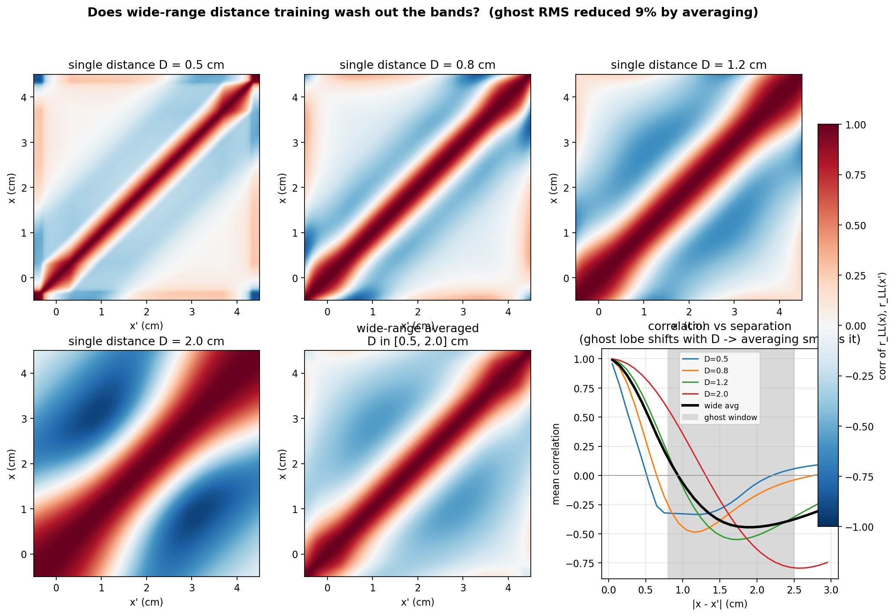
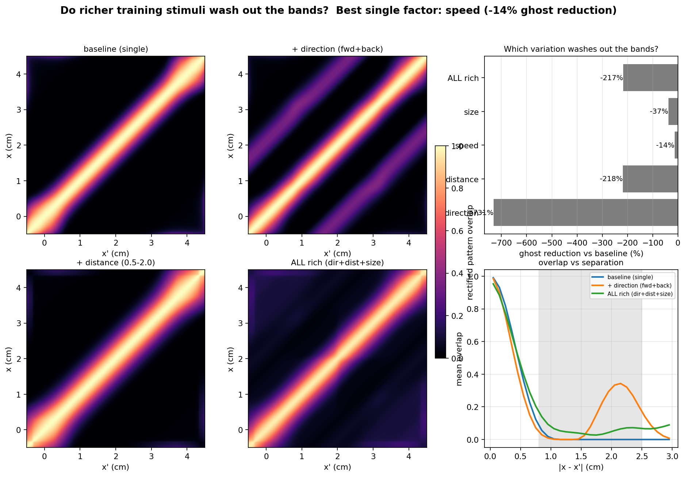

# Private notes — multimodality: distance & direction exploration (2026-07-07)

**Status:** internal only. NOT part of RESULTS.md. Kept here so it is not lost and so a
future session has the reasoning. The *main* multimodality result (feedforward
reconstruction + bipolar LL geometry) IS in `RESULTS.md` Open questions §1 with
`Picture/tuning_multimodality.png`. These two extra analyses were exploratory tests of a
hypothesis that did **not** pan out, so by Julie's rule ("add it only if it makes the
bands disappear") they stay private.

## The question we chased

Julie's hypothesis: the "vertical bands" (multimodal per-TS-cell tuning) might be an
**artifact of our simplified single-condition training**. If a richer, more realistic
stimulus ensemble (varying distance, direction, speed, object size) washed the bands out,
that would show they are a training simplification and "do not exist in reality."

Two analysis-only tests (no Brian2, no retraining — input-statistics proxies).

## Test 1 — distance averaging (`plots/tuning_multimodality_distance.py`)

Does averaging the LL correlation over a wide distance range flatten the band-forming
off-diagonal structure?

- Julie's physical premise was **correct**: the LL peak broadens and lowers with distance.
- **But the effect flips.** A broader peak means distant x-positions **overlap more**, so
  they become **more** correlated — feeding bands, not starving them.
  - Max distant correlation: D=0.5 → +0.21, D=0.8 → +0.17, D=1.2 → +0.47, **D=2.0 → +0.85**.
- Wide-range (0.5–2.0 cm) averaging cut the ghost RMS by only **9%** — bands survive.
- Flip-side insight worth remembering: the **sharpest input (closest distance, D≈0.5) has the
  least band structure**. If anything, going *closer* helps, not a wider range.

## Test 2 — richer ensemble, direction focus (`plots/tuning_multimodality_ensemble.py`)

Band-forming metric = cosine overlap of the **rectified** LL pattern (only actively-driving
neuromasts), which respects neuronal rectification and lets **direction** matter.

Ghost reduction vs baseline (negative = bands get STRONGER):

| variation | effect |
|---|---|
| direction (fwd+back) | **−731%** (much stronger) |
| distance (0.5–2.0) | −218% |
| size (0.3–0.7) | −37% |
| speed (3–8) | −14% |
| ALL rich | −217% |

- **Julie's instinct that direction is the key variable was right** — it dominates all others.
- **But the sign is opposite to the hope:** forward+backward does not blur the bands, it
  **adds a second, mirror-image ghost band at ~2 cm separation** (see the clear secondary
  peak in the orange overlap-vs-separation curve). Physics: a bipolar dipole has a built-in
  **front/back ambiguity** — a source at x moving forward drives the same neuromasts as one
  at x+2 cm moving backward (leading vs trailing lobe).
- Speed and size ≈ 0, as predicted (they only scale amplitude; correlation/overlap is
  amplitude-invariant).

## Conclusion (why this stays private)

The bands are **robust to realistic stimulus variety** (direction, distance, speed, size) —
evidence for **intrinsic dipole geometry**, against the "simplification artifact" framing.
The lines do not disappear, so we did not add these to RESULTS.md. They do reinforce the
main §1 paragraph that is already published.

## Open door (needs a real sim, not analysis)

This proxy ignores **timing**. A real fish can distinguish forward vs backward by the
*temporal order* of the edge, which could break the front/back ambiguity in ways a static
snapshot cannot see. Testing that would need the actual spiking/temporal network (a training
run), so it is out of scope for the analysis-only Step 1. Flag for later if we ever revisit.
